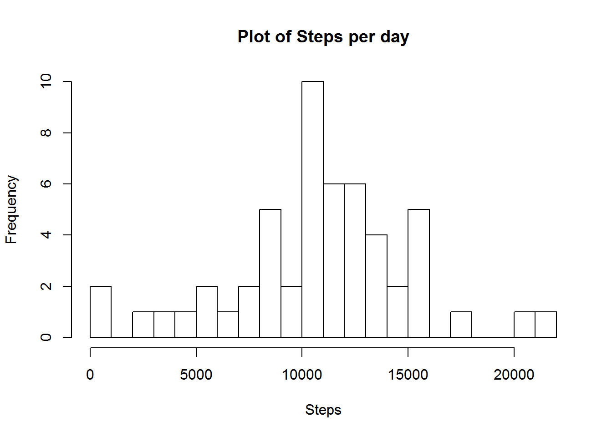
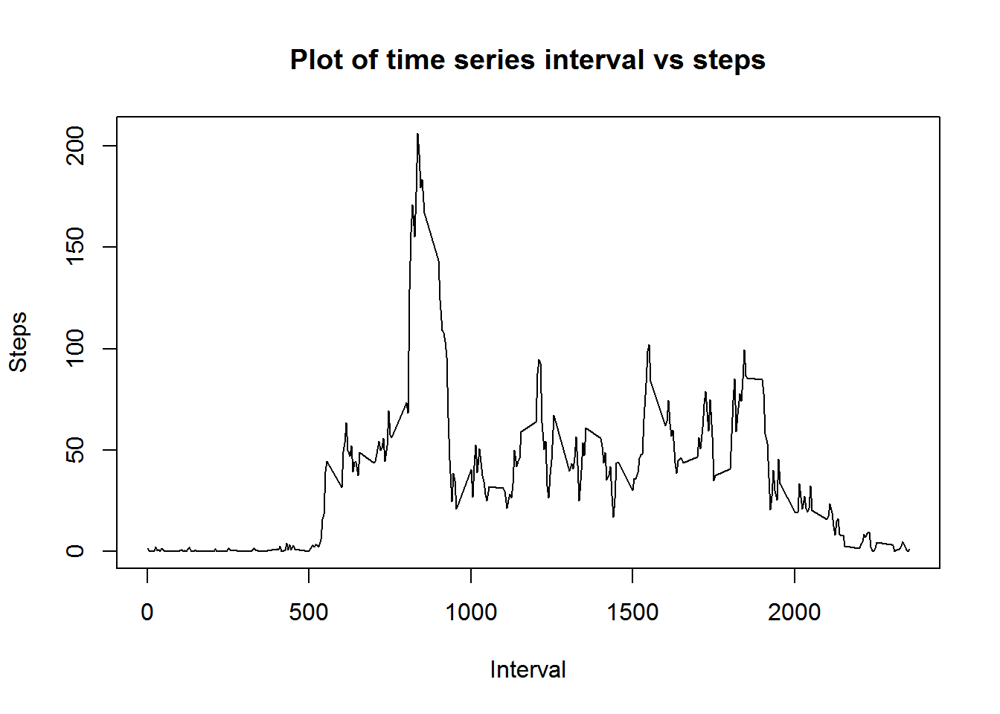
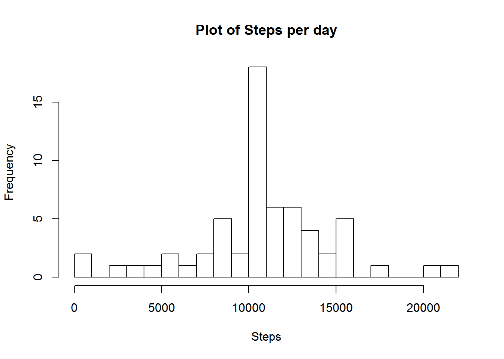
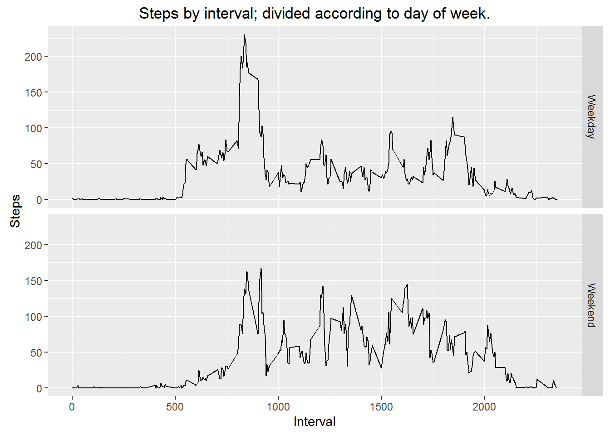

It is now possible to collect a large amount of data about personal movement using activity monitoring devices such as a Fitbit, Nike Fuelband, or Jawbone Up. These type of devices are part of the "quantified self" movement - a group of enthusiasts who take measurements about themselves regularly to improve their health, to find patterns in their behavior, or because they are tech geeks. But these data remain under-utilized both because the raw data are hard to obtain and there is a lack of statistical methods and software for processing and interpreting the data.

This report makes use of data from a personal activity monitoring device. This device collects data at 5 minute intervals through out the day. The data consists of two months of data from an anonymous individual collected during the months of October and November, 2012 and include the number of steps taken in 5 minute intervals each day.

The data for the research can be downloaded from [download data](https://d396qusza40orc.cloudfront.net/repdata%2Fdata%2Factivity.zip)


##Loading the data


### 1. Downloading the data


```r
if(!file.exists("ActivityData.zip")){
    download.file("https://d396qusza40orc.cloudfront.net/repdata%2Fdata%2Factivity.zip",destfile = "ActivityData.zip")
    unzip("ActivityData.zip")
}
```

### 2. Loading the data into R

```r
data = read.csv("activity.csv",header = T)
```

### 3. Preprocessing the data

```r
activityData = data[!is.na(data$steps),]
activityData$date = as.Date(activityData$date,format = "%Y-%m-%d")
```


## Answering what is mean total number of steps taken per day.


### 1. Calculating the total no of steps taken in a day

```r
stepsByDate = aggregate(x = activityData[c("steps")],
                        FUN = sum, by=list(date = activityData$date),
                        na.action=NULL)
head(stepsByDate)
```

```
##         date steps
## 1 2012-10-02   126
## 2 2012-10-03 11352
## 3 2012-10-04 12116
## 4 2012-10-05 13294
## 5 2012-10-06 15420
## 6 2012-10-07 11015
```

### 2. Histogram plot of no of steps


### 3. Calculating the central values of steps

```r
mean(stepsByDate$steps,na.rm=T)
```

```
## [1] 10766.19
```

```r
median(stepsByDate$steps,na.rm=T)
```

```
## [1] 10765
```


## Answering what is the average daily activity pattern.


### 1. Plotting time series plot of interval vs steps.

```r
stepsByInterval = aggregate(x = activityData[c("steps")],
                            by=list(Interval = activityData$interval),
                            FUN = mean
                            )

plot(stepsByInterval$Interval,stepsByInterval$steps,type = "l",xlab = "Interval",ylab = "Steps", main = "Plot of time series interval vs steps")
```



### 3. Calculating maximum steps at interval


```r
stepsByInterval[which.max(stepsByInterval$steps),]
```

```
##     Interval    steps
## 104      835 206.1698
```


## Imputing missing values


### 1. Calculating no of obserations with NA steps


```r
nrow(data[is.na(data$steps),])
```

```
## [1] 2304
```

### 2. Creating a dataset with NAs replaced by mean


```r
dataAll = data
nas = is.na(dataAll$steps)
avgByInterval = tapply(dataAll$steps, dataAll$interval, mean, na.rm=TRUE, simplify=TRUE)
dataAll$steps[nas] = avgByInterval[as.character(dataAll$interval[nas])]
```

### 3. Repeating the above process with new data

```r
stepsByDateAll = aggregate(x = dataAll[c("steps")],
                        FUN = sum, by=list(date = dataAll$date),
                        na.action=NULL)
head(stepsByDateAll)
```

```
##         date    steps
## 1 2012-10-01 10766.19
## 2 2012-10-02   126.00
## 3 2012-10-03 11352.00
## 4 2012-10-04 12116.00
## 5 2012-10-05 13294.00
## 6 2012-10-06 15420.00
```



```r
mean(stepsByDateAll$steps,na.rm=T)
```

```
## [1] 10766.19
```

```r
median(stepsByDateAll$steps,na.rm=T)
```

```
## [1] 10766.19
```

Hence, after imputation the values of both mean and median converges to be the same i.e. 10766.19


## Answering are there differences in activity patterns between weekdays and weekends

### 1. Adding a new column day in the dataset


```r
dataAll$day = ifelse(weekdays(as.Date(dataAll$date,"%Y-%m-%d")) == "Saturday" | weekdays(as.Date(dataAll$date,"%Y-%m-%d")) == "Sunday","Weekend","Weekday")

head(dataAll)
```

```
##       steps       date interval     day
## 1 1.7169811 2012-10-01        0 Weekday
## 2 0.3396226 2012-10-01        5 Weekday
## 3 0.1320755 2012-10-01       10 Weekday
## 4 0.1509434 2012-10-01       15 Weekday
## 5 0.0754717 2012-10-01       20 Weekday
## 6 2.0943396 2012-10-01       25 Weekday
```

### 2. Plotting the data separated by days of week i.e a weekday or a weekend

```r
stepsByInterval = aggregate(x = dataAll[c("steps")],
                            by=list(Interval = dataAll$interval,day = dataAll$day),
                            FUN = mean
                            )

head(stepsByInterval)
```

```
##   Interval     day      steps
## 1        0 Weekday 2.25115304
## 2        5 Weekday 0.44528302
## 3       10 Weekday 0.17316562
## 4       15 Weekday 0.19790356
## 5       20 Weekday 0.09895178
## 6       25 Weekday 1.59035639
```

```r
library(ggplot2)
plot = ggplot(stepsByInterval,aes(x = Interval, y = steps))
plot + geom_line()+ 
    facet_grid(day~.)+ 
    labs(x="Interval", y="Steps")+ 
   labs(title="Steps by interval; divided according to day of week.")
```



From the plots we see that during the weekdays, activity is seen during early time frames after which the activiyies are substancially reduced. Whereas, during weekends activity is seen throughout the day.
